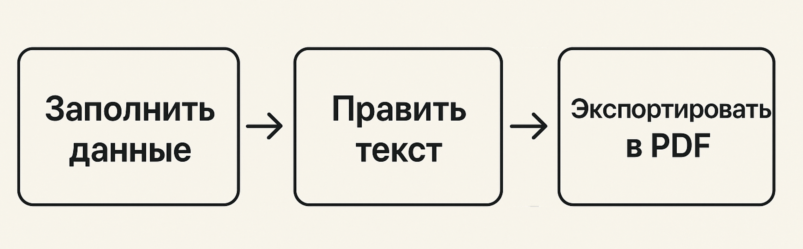
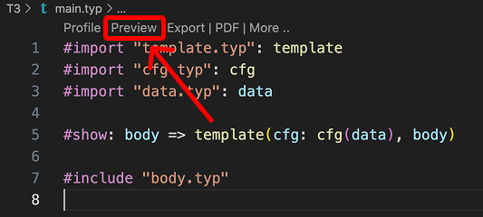
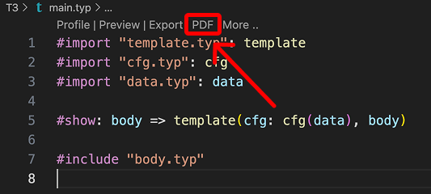

# Генератор ТЗ для курсового проекта

## 📝 Описание
Это шаблон технического задания (ТЗ) в формате Typst, подготовленный как помощник для студентов при оформлении курсовых работ. Шаблон старается соответствовать требованиям ГОСТ и даёт удобный рабочий процесс: 



Это инструмент для ускорения работы — всё окончательное оформление и ответственность за содержание остаются за студентом.

---

## 🗝 Гайд по исопльзованию

0. Установите [плагин Typst](https://marketplace.visualstudio.com/items?itemName=myriad-dreamin.tinymist) для VS Code (поиск в Extensions → `Typst`).

1. Клонируйте репозиторий:

```bash
git clone https://github.com/vasyukov1/TZGeneration.git
cd TZGeneration
```

2. В `data.typ` заполните свои данные: 
    - код проекта
    - название проекта
    - имена и группы участников
    - научный руководитель и его должность

3. Напишите основной текст документа в `body.typ`. В файле уже есть структура разделов и шаблонных таблиц – редактируйте содержимое и добавляйте свои пункты.

4. В VS Code откройте `main.typ`. Вверху файла нажмите **Preview** (кнопка плагина) для предпросмотра документа при редактировании.



5. Для получения PDF нажмите кнопку **PDF** (в интерфейсе расширения Typst, в файле `main.typ`).



> Предпросмотр обновляется при сохранении файла. Если рендер не запускается, попробуйте сохранить `main.typ` или перезапустить окно VS Code. У меня стоит автосохранение файла при смене контекста – удобно.

---

## 🗂 Структура репозитория

* `main.typ` - запуск
* `template.typ` - шаблон страниц
* `cfg.typ` - конфигурация
* `data.typ` - данные проекта
* `body.typ` - основной текст ТЗ

---

## 📖 Обязательные разделы по ГОСТу

Шаблон ориентирован на ГОСТ и включает основные разделы ТЗ. В `body.typ` разделы, обязательные для оформления, начинаются с `=`:

* ВВЕДЕНИЕ
* ОСНОВАНИЯ ДЛЯ РАЗРАБОТКИ
* НАЗНАЧЕНИЕ РАЗРАБОТКИ
* ТРЕБОВАНИЯ К ПРОГРАММЕ
* ТРЕБОВАНИЯ К ПРОГРАММНОЙ ДОКУМЕНТАЦИИ
* ТЕХНИКО-ЭКОНОМИЧЕСКИЕ ПОКАЗАТЕЛИ
* СТАДИИ И ЭТАПЫ РАЗРАБОТКИ
* ПОРЯДОК КОНТРОЛЯ И ПРИЕМКИ
* СПИСОК ИСПОЛЬЗУЕМОЙ ЛИТЕРАТУРЫ
* ПРИЛОЖЕНИЕ (если есть)

---

## 📜 Данные в `data.typ`

Для удобства все ваши данные просто вписываются в переменные:

* `code` – код проекта, его можно посмотреть на [сайте классифиактора ПО](https://ru-ikt.ru/reestrpo)
* `project_name` – название проекта
* `project_name_english` – название проекта на английском
* `students` – список студентов (имя + группа)
* `agreed_by_name` – научный руководитель 
* `agreed_by_position` – должность научного руководителя

---

## 📘 Примеры готовых ТЗ

Пример готовых ТЗ можно найти здесь:

* [Моё ТЗ за 2 курс](https://github.com/vasyukov1/HSE-FCS-SE-2-year/tree/main/Term-Paper/%D0%A2%D0%97%20%D0%BA%D0%BE%D0%BC%D0%B0%D0%BD%D0%B4%D0%BD%D0%BE%D0%B5)
* [Лучшие проекты ФНК ВШЭ](https://cs.hse.ru/cppr/best_projects)

Нет гарантии, что в этих примерах всё идеально.

---

## 📞 Контакты и обратная связь

Спасибо [Савве](https://github.com/kotfind), который придумал сделать такой шаблон!

Если нашли неточности, ошибки или хотите предложить улучшения – свяжитесь со мной в Telegram: [@vasyukov_al](https://t.me/vasyukov_al)

И подписывайтесь на канал **[«Сверхразум говорит»](https://t.me/overmindv)**
